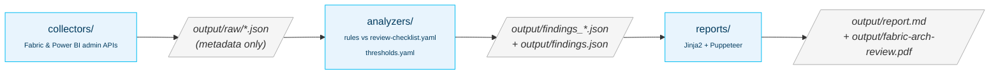

# Fabric Architecture Review Accelerator

[](LICENSE)
[](https://www.python.org/downloads/)
[](#-running-the-review)
[](#-data-safety-read-this-first)

A reusable, **Well-Architected-Framework–aligned** accelerator that audits a **Microsoft Fabric**
tenant and turns the results into a client-ready report — **without ever reading customer
business data**. Clone it per engagement, point it at the in-scope tenant/workspaces, run
the pipeline, and hand over a branded PDF plus structured JSON findings.

It evaluates seven review dimensions against a documented rule catalog:

| | Dimension | Example checks |
|---|---|---|
| 🏛️ | **Architecture** | Medallion layering, capacity assignment, shortcuts, Git, deployment pipelines, storage mode |
| ⚡ | **Performance** | Throttling, CU%, model size, refresh SLOs, VertiPaq footprint, job reliability |
| 🛡️ | **Security** | Tenant settings, workspace access, gateways, private connectivity |
| 🧭 | **Governance** | Admin coverage, sensitivity labels, naming, sharing volume, workspace lifecycle |
| 💰 | **Cost** | SKU right-sizing, pause/resume, non-prod consolidation |
| ⚙️ | **Tenant Settings** | Tenant-wide vs scoped switches, external sharing, custom visuals |
| ✅ | **Best Practices** | Model/report BPA, Direct Lake fallback, Delta table health, unused objects, P→F capacity readiness (Fabric runs) |

---

## 📑 Table of contents

- [Data safety — read this first](#-data-safety-read-this-first)
- [How it works](#-how-it-works)
- [Getting started](#-getting-started)
  - [Prerequisites](#prerequisites)
  - [Install](#install)
  - [Configure](#configure)
- [Running the review](#-running-the-review)
  - [Locally (PowerShell)](#locally-powershell)
  - [Inside Fabric (no workstation)](#inside-fabric-no-workstation)
  - [Running a single stage](#running-a-single-stage)
- [Permissions & roles](#-permissions--roles)
- [Configuration reference](#-configuration-reference)
- [Outputs & reports](#-outputs--reports)
- [Rule catalog & status](#-rule-catalog--status)
- [Extending the framework](#-extending-the-framework)
- [Testing](#-testing)
- [Repository layout](#-repository-layout)
- [Documentation](#-documentation)
- [Contributing](#-contributing)
- [Security](#-security)
- [Trademarks](#-trademarks)
- [License](#-license)

---

## 🔒 Data safety — read this first

> **This tool NEVER reads, queries, or extracts customer business data.**

The accelerator collects only **metadata, configuration, inventory, and metrics**. It is
explicitly designed so that no business data ever leaves the customer tenant through this
tool. Every collector module carries a `# DATA SAFETY:` comment documenting exactly what
it reads, and code review rejects any change that breaks this contract.

**What it collects**

- Tenant settings (Admin API)
- Workspace and item inventory (Scanner API — metadata only)
- Capacity utilization and throttling metrics
- Item counts, sizes, owners, capacity assignment
- Semantic model **definition metadata** via Fabric `getDefinition` / TMDL (table/column names, partition modes, source hints, calculated tables/columns — **no row data**)
- Semantic model **VertiPaq storage statistics** (Fabric runs only) via `semantic-link-labs` — per-table/column size, encoding, data type from storage-engine DMVs. Exact column **cardinality** is opt-in (`VERTIPAQ_STATS_READ_DATA=true`) and returns aggregate distinct-counts only, never row values
- **Best Practice Analyzer** results (Fabric runs only) via `semantic-link-labs` — model/report BPA rule outcomes, Direct Lake fallback reasons, Delta table health, unused object names, and capacity SKU readiness. Outcomes + engine metadata only, never row data
- Pipeline / notebook **run history** (duration, status, error codes)
- Pipeline activity JSON and notebook **source code** (cells only, never `outputs`) via Fabric `getDefinition` — used for parameter-contract checks (`ARCH-012`) and a heuristic code-smell scan (`NBCODE-001..006`)
- Git integration configuration
- Admin Activity Log (configurable lookback — default last **7 days**, max 30)
- *Opt-in only:* pre-aggregated Capacity Metrics App tables (DAX via `executeQueries`)
- *Opt-in only:* Azure ARM read of Automation runbooks / Logic Apps for capacity Pause/Resume detection

<details>
<summary><strong>What it never does — explicitly forbidden in this codebase</strong></summary>

- ⛔ Execute DAX `EVALUATE` against customer-authored semantic models (the only DAX issued targets the Microsoft-published Capacity Metrics App, gated behind `CAPACITY_METRICS_APP_INSTALLED=true`)
- ⛔ Run `SELECT` on Lakehouse / Warehouse tables
- ⛔ Read OneLake file contents
- ⛔ Read notebook cell outputs
- ⛔ Call `getArtifactUsers` or any scope returning PII (`datasetSchema`, `datasetExpressions`, `datasourceDetails`)
- ⛔ Persist API payloads that could contain business data outside the gitignored `output/raw/`

See **[docs/data-safety.md](docs/data-safety.md)** for the full allow / deny list of API endpoints.
</details>

---

## 🧩 How it works

The accelerator is a three-stage pipeline — **collect → analyze → report** — where each
stage only depends on files written by the previous one, so any stage can be re-run in
isolation.



1. **Collectors** call Fabric / Power BI admin APIs and write raw metadata JSON to `output/raw/`. They only read configuration and metrics — never customer data.
2. **Analyzers** load those JSON files, evaluate them against the rules in [config/review-checklist.yaml](config/review-checklist.yaml), and emit one `output/findings_<dimension>.json` per dimension. Each finding has `rule_id`, `dimension`, `severity`, `status` (`pass`/`fail`/`info`), `evidence`, `recommendation`. **Every numeric pass/fail boundary lives in [config/thresholds.yaml](config/thresholds.yaml)** — the single, documented place to tune the review to a client's SLOs (precedence: environment variable › `thresholds.yaml` › built-in default).
3. **Reports** merge every `findings_*.json` into `output/findings.json`, render Jinja2 templates plus auto-generated **Mermaid architecture diagrams** of the tenant, and convert the result to a branded PDF via headless Chromium (Puppeteer). On Fabric runs, a **VertiPaq Footprint** section adds per-model size summaries and the largest tables/columns per model.

The PowerShell scripts under `scripts/` orchestrate each stage end-to-end on Windows; you
can also run any module directly (see [Running a single stage](#running-a-single-stage)).

---

## 🚀 Getting started

### Prerequisites

| Requirement | Notes |
|---|---|
| **Python 3.11+** | With a virtual environment. |
| **Node.js 18+ + Puppeteer** | Needed only for the PDF stage: `npm install -g puppeteer`. `reports/_generate_pdf.py` spawns `node` with `NODE_PATH=%APPDATA%\npm\node_modules`, so a **global** install is expected. Tested with **Node 24.14** and **Puppeteer 24.40** (any Node ≥ 18 / Puppeteer ≥ 21 works). **Without Node**, the PDF stage degrades gracefully — it writes a self-contained `report.html` next to the target PDF that you can open in any browser and **Print → Save as PDF**. |
| **A user account in the client's Entra tenant** | Auth runs interactively as **you** (Azure CLI session if present, otherwise a browser sign-in). No service principal, no client secret. For unattended/scheduled baselines you can *optionally* run as a read-only **service principal** instead (create a Web v2 cloud connection for it after setup) — see [docs/auth-setup.md](docs/auth-setup.md). |
| **A Fabric / Power BI role** | Determines what you can collect — see [Permissions & roles](#-permissions--roles). For a full review, request **Fabric Administrator**. |

### Install

**Windows (PowerShell):**

```powershell
# 1. Clone the accelerator for this engagement
git clone https://github.com/biro98/fabric-architecture-review.git fabric-review-<client>
cd fabric-review-<client>

# 2. Python environment
python -m venv .venv
.\.venv\Scripts\Activate.ps1
pip install -r requirements.txt

# 3. (one-time, machine-wide) Puppeteer for the PDF stage
npm install -g puppeteer
```

**Linux / macOS (bash):**

```bash
# 1. Clone the accelerator for this engagement
git clone https://github.com/biro98/fabric-architecture-review.git fabric-review-<client>
cd fabric-review-<client>

# 2. Python environment
python3 -m venv .venv
source .venv/bin/activate
pip install -r requirements.txt

# 3. (one-time, machine-wide) Puppeteer for the PDF stage
npm install -g puppeteer
```

### Configure

```powershell
# Windows (PowerShell)
Copy-Item .env.example .env
notepad .env
```

```bash
# Linux / macOS (bash)
cp .env.example .env
${EDITOR:-nano} .env
```

At minimum set `TENANT_ID`, `CLIENT_NAME`, and `REVIEWER_NAME`. All other settings are
optional and documented inline in [.env.example](.env.example). See the
[Configuration reference](#-configuration-reference) for the full list, including the
opt-in deep probes and pass/fail threshold overrides.

---

## ▶️ Running the review

> **Choosing a run mode:** run **locally** (PowerShell) to review *any* tenant where your
> account is a guest/member; run **in Fabric** to review the tenant that **owns the
> workspace**. The full comparison and step-by-step Fabric deployment are in
> **[fabric/README.md](fabric/README.md)**.

### Locally (PowerShell — Windows)

```powershell
# Sign in once (recommended — avoids a browser popup on every run).
# Target ANY tenant where your account is a guest/member:
az login --tenant <client-tenant-id>

# Run the three stages
.\scripts\powershell\01_collect.ps1   # writes output/raw/*.json (skips collectors you lack permission for)
.\scripts\powershell\02_analyze.ps1   # writes per-dimension output/findings_*.json, then merges to findings.json
.\scripts\powershell\03_report.ps1    # writes output/report.md and output/fabric-arch-review.pdf
```

### Locally (bash — Linux / macOS)

Native bash equivalents of the three stage scripts are provided — **no PowerShell required**:

```bash
# Sign in once against the in-scope tenant
az login --tenant <client-tenant-id>

# First time only: make the scripts executable
chmod +x scripts/bash/*.sh

# Run the three stages
./scripts/bash/01_collect.sh   # writes output/raw/*.json (skips collectors you lack permission for)
./scripts/bash/02_analyze.sh   # writes per-dimension output/findings_*.json, then merges to findings.json
./scripts/bash/03_report.sh    # writes output/report.md and output/fabric-arch-review.pdf
```

> Prefer to run [PowerShell 7+](https://learn.microsoft.com/powershell/scripting/install/installing-powershell)
> (`pwsh`)? The `.ps1` scripts under `scripts/powershell/` run unchanged on Linux/macOS too. Or invoke any single
> collector/analyzer directly as shown in [Running a single stage](#running-a-single-stage).

Open `output/fabric-arch-review.pdf` to see the result.

### Inside Fabric (no workstation)

Run the entire review **inside a Fabric workspace** — no local machine required — by
importing a single setup notebook that deploys the Lakehouse, the four stage notebooks
(Collect → Analyze → Gold → Report), the orchestration pipeline, and an interactive
**Direct Lake Power BI report** over a gold-layer history. This is the right
mode when the client runs it themselves, for a tenant-resident reviewer, or for
unattended/scheduled runs.

The deployed Power BI report is a 15-page platform-assessment dashboard — an executive
**Overview** (platform-maturity radar, best-practice-score gauge, severity heatmap, top-risk
workspaces), a **Trends** history, an **Estate Map**, a page per review dimension (plus a
Fabric-only **Best Practices** page), and **Semantic Models / Model detail / Model internals /
Notebooks** deep-dives — all live over the Lakehouse with no scheduled refresh.

Full deployment steps, the gold-table schema, the report page guide, and the optional Azure
(ARM) service-principal setup for the capacity Pause/Resume scan are in
**[fabric/README.md](fabric/README.md)**.

### Running a single stage

**Windows (PowerShell)** — line continuation is the backtick `` ` ``:

```powershell
# Collector
python -m collectors.tenant_settings

# Analyzer
python -m analyzers.tenant_settings_review `
  --raw-dir output/raw `
  --checklist config/review-checklist.yaml `
  --out output/findings_tenant_settings.json

# Report
python -m reports.render_report --findings output/findings.json --out output/report.md
python reports/_generate_pdf.py `
  --input output/report.md `
  --output output/fabric-arch-review.pdf `
  --title "Fabric Architecture Review"
```

**Linux / macOS (bash)** — line continuation is the backslash `\`:

```bash
# Collector
python -m collectors.tenant_settings

# Analyzer
python -m analyzers.tenant_settings_review \
  --raw-dir output/raw \
  --checklist config/review-checklist.yaml \
  --out output/findings_tenant_settings.json

# Report
python -m reports.render_report --findings output/findings.json --out output/report.md
python reports/_generate_pdf.py \
  --input output/report.md \
  --output output/fabric-arch-review.pdf \
  --title "Fabric Architecture Review"
```

> Every collector/analyzer is plain Python, so the per-stage commands are identical on
> Windows, Linux, and macOS — only the shell's line-continuation character differs.

---

## 🔑 Permissions & roles

All collectors run as the **signed-in user** (delegated). What you can actually collect
depends on the Fabric / Power BI role assigned to that user.

**Recommendation:** request **Fabric Administrator** on the tenant for the duration of the
engagement. The next-best fallback is **Power BI Administrator** + **Capacity Admin** on
every in-scope F-SKU capacity. Without a tenant admin role, the tenant-settings and
scanner sections are skipped (with an info note) and you are limited to the
workspace-scoped collectors for workspaces you belong to.

> Tenant-level roles are granted in **Microsoft 365 admin center → Roles**. Workspace-level
> roles (Admin / Member / Contributor / Viewer) are granted per workspace in the Fabric
> portal. Full details and tenant-setting prerequisites are in
> [docs/auth-setup.md](docs/auth-setup.md).

<details>
<summary><strong>Full collector × role capability matrix</strong></summary>

| Collector / capability | Fabric Admin / Power BI Admin | Capacity Admin | Workspace Admin | Member | Contributor | Viewer | No role |
|---|---|---|---|---|---|---|---|
| `tenant_settings` (Admin Tenant Settings API) | ✅ Full | ❌ | ❌ | ❌ | ❌ | ❌ | ❌ |
| `scanner_api` (Admin Scanner — workspaces + items, tenant-wide) | ✅ All workspaces | ❌ | ❌ | ❌ | ❌ | ❌ | ❌ |
| `activity_logs` (Admin Activity Events) | ✅ Tenant-wide | ❌ | ❌ | ❌ | ❌ | ❌ | ❌ |
| `capacity_metrics` (capacities + refreshables + workloads) | ✅ All | ✅ Yours | ❌ | ❌ | ❌ | ❌ | ❌ |
| `workspace_inventory` (`/v1/admin/groups` + `/items`) | ✅ Any | ❌* | ✅ | ✅ | ✅ | 👁️ read | ❌ |
| `semantic_models` (dataset metadata + refresh history) | ✅ All | — | ✅ | ✅ | ✅ | 👁️ read | ❌ |
| `lakehouse_warehouse` (lakehouse/warehouse + table metadata) | ✅ All | — | ✅ | ✅ | ✅ | 👁️ read | ❌ |
| `pipelines_notebooks` (pipelines + notebooks + job runs) | ✅ All | — | ✅ | ✅ | ✅ | 👁️ read | ❌ |
| `realtime_intelligence` (eventhouses, KQL DBs, eventstreams, reflexes, mirrored DBs) | ✅ All | — | ✅ | ✅ | ✅ | 👁️ read | ❌ |
| `semantic_model_definitions` (TMDL/BIM via `getDefinition`) | ✅ All | — | ✅ | ✅ | ✅ | ❌ (needs write) | ❌ |
| `vertipaq_stats` (VertiPaq Analyzer — **Fabric run only**) | ✅ All | — | ✅ | ✅ | ✅ | ❌ (XMLA read) | ❌ |
| `pipeline_definitions` (pipeline + notebook source via `getDefinition`) | ✅ All | — | ✅ | ✅ | ✅ | ❌ (needs write) | ❌ |
| `git_integration` (`/git/connection`) | ✅ All | — | ✅ | ❌ (Admin req.) | ❌ | ❌ | ❌ |
| `deployment_pipelines` (Power BI Deployment Pipelines) † | ✅ All | ❌ | 👁️ yours | 👁️ yours | 👁️ yours | ❌ | ❌ |
| `gateways` (on-prem / VNet / personal gateway inventory) † | 👁️ yours | ❌ | 👁️ yours | 👁️ yours | 👁️ yours | ❌ | ❌ |
| `capacity_metrics_app` *(opt-in)* — DAX vs Capacity Metrics App ‡ | ✅ with **Build** | ✅ with **Build** | — | — | — | — | ❌ |
| `azure_capacity_automation` *(opt-in)* — ARM Pause/Resume scan ‡ | Azure **Reader** | Azure **Reader** | — | — | — | — | ❌ |
| Analyzers + report rendering (offline, on collected JSON) | ✅ | ✅ | ✅ | ✅ | ✅ | ✅ | ✅ |

**Legend** — ✅ supported · 👁️ partial / read-only fields · ❌ not allowed by the API · — not applicable · *unless also a workspace member

> † `deployment_pipelines` and `gateways` use user-context endpoints that return only the
> pipelines / gateways on which the signed-in user is an **admin**; both degrade gracefully
> to an empty inventory otherwise.
>
> ‡ The two opt-in collectors are gated behind `.env` flags and need a permission *outside*
> the Fabric role model — **Build** on the Capacity Metrics App semantic model, and Azure
> **Reader** on the subscription(s) hosting the capacity / Automation account / Logic App.
</details>

<details>
<summary><strong>What each role sees in the final report</strong></summary>

| Your role | What you get in `fabric-arch-review.pdf` |
|---|---|
| **Fabric Administrator** (recommended) | Full report: tenant security posture, every workspace's topology and items, all diagram types, and all findings across every dimension. |
| **Power BI Administrator** | Same as Fabric Admin today — both satisfy the Admin APIs we call. (Fabric Admin is the forward-looking role.) |
| **Capacity Admin only** | No tenant settings, no scanner data. `capacity_metrics` returns the capacities you administer, feeding `COST-001/003/005`. Tenant-settings section is skipped with an info note. |
| **Workspace Admin / Member / Contributor** | Tenant-settings and scanner sections skipped. Per-workspace collectors run against the workspaces you belong to and produce ARCH/PERF/GOV/SEC findings scoped to those workspaces. |
| **Workspace Viewer** | Read-only metadata for visible workspaces. No Git-integration findings (requires Admin). |
| **No role** | The pipeline runs but `output/raw/` stays empty and the report contains only the executive-summary placeholder. |
</details>

---

## ⚙️ Configuration reference

All settings live in `.env` (copy from [.env.example](.env.example)). Highlights:

| Setting | Purpose | Default |
|---|---|---|
| `TENANT_ID` | Client tenant to review (auth runs as you). | *(required)* |
| `CLIENT_NAME`, `ENGAGEMENT_NAME`, `REVIEWER_NAME` | Engagement metadata rendered into the report. | `Contoso` / `Fabric Architecture Review` / *(empty)* |
| `OUTPUT_DIR` | Per-engagement output folder; all raw/findings/report land under it. | `output` |
| `WORKSPACE_IDS` | Comma/whitespace-separated workspace GUIDs to scope the run. Empty = tenant-wide. | *(empty)* |
| `ACTIVITY_DAYS_LOG` | Activity-log lookback window in days (1–30 per Fabric Admin API). Legacy alias `ACTIVITY_LOG_DAYS` is still honoured. In Fabric this is exposed as a selectable pipeline parameter. | `7` |
| `FOOTER_LABEL` | Override the PDF footer label. | `<CLIENT_NAME> — <ENGAGEMENT_NAME>` |
| `REPORT_BRAND` | Brand / organization label on the PDF cover and page header. Empty = no brand (no Microsoft or any brand shown). | *(empty)* |
| `REPORT_LOGO` | Path to a PNG cover logo (any brand). Empty/missing = no logo; none is shipped. | *(empty)* |
| `CAPACITY_METRICS_APP_INSTALLED` | **Opt-in.** Enables DAX against the Capacity Metrics App (`PERF-001/002`). | `false` |
| `CAPACITY_AUTO_PAUSE_CONFIGURED` | **Opt-in.** Enables the Azure ARM Pause/Resume scan (`COST-002`). | `false` |
| `VERTIPAQ_STATS_READ_DATA` | **Opt-in (Fabric).** Add exact column cardinality via aggregate `COUNT` DAX. | `false` |

### Tuning pass/fail thresholds

Every numeric boundary that turns a rule into **pass** / **fail** / **info** is defined and
documented in **[config/thresholds.yaml](config/thresholds.yaml)** — the single place to
tune the review to a client's maturity and SLOs. Values resolve with the precedence
**environment variable › `thresholds.yaml` › built-in default**, so CI pipelines and the
Fabric notebook parameters can override any single value without editing the file. A
missing or malformed file never breaks a run — analyzers fall back to built-in defaults.
See [docs/methodology.md](docs/methodology.md#pass--fail-and-thresholds).

### Scoping & isolation

- **Scope to specific workspaces:** set `WORKSPACE_IDS`. `scanner_api`, `workspace_inventory`, and `semantic_models` filter to that set; every downstream collector that reads `scanner.json` inherits the scope. Tenant-wide collectors (`tenant_settings`, `activity_logs`, `capacity_metrics`, `gateways`, `deployment_pipelines`) still report tenant-level facts by design.
- **Isolate engagements:** set `OUTPUT_DIR=output/<client>` so each engagement's raw JSON, findings, and report live under a separate folder. All three pipeline scripts honour it.

### Customizing the PDF & branding

The report carries **no brand by default** — no logo and no organization name are rendered
unless you ask for them. Set your own via `.env` (`REPORT_BRAND`, `REPORT_LOGO`,
`FOOTER_LABEL`) or per-run flags, which take precedence over `.env`:

```powershell
python reports/_generate_pdf.py `
  --input output/report.md `
  --output output/fabric-arch-review.pdf `
  --title "Contoso — Fabric Architecture Review 2026 Q2" `
  --brand "Contoso Consulting" `
  --footer-label "Contoso — Confidential" `
  --logo path/to/your-logo.png
```

- `--brand` / `REPORT_BRAND` sets the cover eyebrow and the top-right page-header label. Empty = no brand line.
- `--logo` / `REPORT_LOGO` points at any PNG and renders it above the cover `<h1>`. No logo ships with the repo, so the cover is logo-free until you supply one (see [reports/images/README.md](reports/images/README.md)).

---

## 📤 Outputs & reports

| Artifact | Description |
|---|---|
| `output/raw/*.json` | Raw collected metadata (one file per collector). Gitignored. |
| `output/findings_<dimension>.json` | Per-dimension findings from each analyzer. |
| `output/findings.json` | Merged findings consumed by the report. |
| `output/report.md` | Rendered Markdown report (exec summary, findings by dimension, roadmap). |
| `output/fabric-arch-review.pdf` | Branded, client-ready PDF with auto-generated architecture diagrams. |

> 📄 **See a sample.** An example report — generated from the fully synthetic
> test fixture — is committed under [`samples/report.md`](samples/report.md) and
> [`samples/fabric-arch-review-sample.pdf`](samples/fabric-arch-review-sample.pdf). Regenerate
> it any time with `python -m tests.gen_sample_report`. All identifiers in the sample are
> masked (`***`) for public distribution; a real engagement run retains the actual
> per-resource IDs so every finding is directly actionable.

> 🖨️ **No Node.js?** The PDF stage degrades gracefully: when `node` is not on PATH it writes a
> self-contained `report.html` next to the target PDF — open it in Chrome/Edge and
> **Print → Save as PDF** (Letter, Background graphics on). Diagrams render from a CDN, so
> open it online the first time.

The report also auto-generates Mermaid diagrams of the client's tenant from whatever raw
JSON is present (each builder skips itself with a friendly note when its input is missing):

| Diagram | Source file |
|---|---|
| Tenant security posture (pass/fail per setting) | `tenant_settings.json` |
| Capacity → Workspace topology | `scanner.json` |
| Workspace items map (lakehouses, warehouses, models, pipelines) | `scanner.json` |
| Git integration map (workspace → repo / branch) | `git_integration.json` |

---

## 📋 Rule catalog & status

All seven dimensions are implemented end-to-end. Every collector runs against documented
Fabric / Power BI REST endpoints; every analyzer emits findings against the rule catalog in
[config/review-checklist.yaml](config/review-checklist.yaml). The reader-friendly index
with Microsoft Learn references is in [docs/checklist-reference.md](docs/checklist-reference.md).

| Dimension | Collectors | Analyzer (rules) | Status |
|---|---|---|---|
| Tenant Settings | `tenant_settings` | `tenant_settings_review` (`SEC-001/002`, `TENANT-001..005`) | ✅ |
| Architecture | `scanner_api`, `workspace_inventory`, `git_integration`, `lakehouse_warehouse`, `deployment_pipelines`, `realtime_intelligence`, `semantic_models`, `pipeline_definitions` | `architecture_review` (`ARCH-001..014`) | ✅ |
| Performance | `semantic_models`, `capacity_metrics`, `capacity_metrics_app` (opt-in), `pipelines_notebooks`, `semantic_model_definitions`, `vertipaq_stats` (Fabric) | `performance_review`, `semantic_model_storage_review` (`PERF-001..014`) | ✅ |
| Governance | `scanner_api`, `git_integration`, `activity_logs` | `governance_review` (`GOV-001..007`) | ✅ |
| Security | `scanner_api`, `tenant_settings`, `gateways` | `security_review` (`SEC-003..011`) | ✅ |
| Cost | `capacity_metrics`, `scanner_api`, `azure_capacity_automation` (opt-in) | `cost_review` (`COST-001..005`) | ✅ |
| Notebook code (heuristic) | `pipeline_definitions` (decoded `.py` / `.ipynb` source) | `notebook_code_review` (`NBCODE-001..006`) | ✅ |
| Best Practices (Fabric) | `best_practices` (BPA / Direct Lake fallback / Delta / capacity via `semantic-link-labs`) | `best_practices_review` (`BPA-001..007`) | ✅ |

<details>
<summary><strong>Notable checks & opt-in deep probes</strong></summary>

- **Release engineering** (`ARCH-009`) — production workspaces governed by Deployment Pipelines.
- **Real-Time Intelligence + mirroring** (`ARCH-010`) — inventories Eventhouses, KQL DBs, Eventstreams, Reflex/Activator, Mirrored Databases.
- **Storage-mode mix** (`ARCH-011`) — Import / DirectQuery / Direct Lake distribution; flags Import-heavy workloads over lakehouse data.
- **Scanner collection integrity** (`ARCH-013`) — fails the review when a Scanner run was partial, so an incomplete inventory is never mistaken for the whole tenant.
- **Deployment-pipeline drift** (`ARCH-014`) — items left unpromoted to prod or whose last deployment is older than the staleness window.
- **Refresh reliability / concurrency** (`PERF-010`, `PERF-014`) — consecutive refresh failures; overlapping refresh windows contending for CU.
- **Autoscale posture** (`PERF-011`) — hot capacities (≥ 70% avg CU 7d) without autoscale.
- **Direct Lake fallback** (`PERF-013`) — models relying on implicit DirectQuery fallback instead of explicit `directLakeBehavior`.
- **Workspace lifecycle** (`GOV-006`) — orphaned workspaces (content present, no admin activity in window).
- **Capacity Metrics App** (`GOV-007`) — verifies the first-party app is installed.
- **Gateway posture** (`SEC-008/009/010/011`) — single-member cluster SPOF, VNet/private connectivity, version currency, personal-mode credential hygiene.
- **Tenant baseline** (`TENANT-003..005`) — external data sharing, uncertified custom visuals, R/Python visual & script runtime.
- **Notebook code-smell scan** (`NBCODE-001..006`) — heuristic regex over decoded notebook source: hard-coded secrets, inline `%pip install`, `.collect()`/`.toPandas()`/`display()`, Databricks-only APIs, hard-coded `abfss://` paths/GUIDs, non-Delta writes. Findings reference notebook name + cell index only — cell content never leaves the analyzer (marked `heuristic: true`).
- **VertiPaq footprint** (`vertipaq_stats`, **Fabric-only**) — storage-engine scan of every Import / Direct Lake model (per-table/column size, encoding, data type, optional cardinality). Powers the report's VertiPaq Footprint section. Metadata only; cardinality opt-in.

**Opt-in deep metrics.** `PERF-001/002` are sourced from the Capacity Metrics App via
`executeQueries` against pre-aggregated tables — gated behind `CAPACITY_METRICS_APP_INSTALLED=true`.
If unset, the collector short-circuits before any DAX call and the rules degrade to `info`.

**Opt-in Pause/Resume detection.** `COST-002` can be auto-verified by reading Azure:
`azure_capacity_automation` scans Automation runbooks and Logic Apps in subscriptions that
host a `Microsoft.Fabric/capacities` resource — gated behind `CAPACITY_AUTO_PAUSE_CONFIGURED=true`.
If unset, no ARM call is made at all.
</details>

---

## 🧱 Extending the framework

To add a new dimension end-to-end:

1. **Collector** — implement `collectors/<name>.py` that writes `output/raw/<name>.json`. Keep the `# DATA SAFETY:` comment and stick to the metadata-only endpoints in [docs/data-safety.md](docs/data-safety.md).
2. **Analyzer** — implement `analyzers/<name>_review.py` that reads that JSON, applies rules from `config/review-checklist.yaml`, resolves any numeric boundary via `analyzers._common.threshold()`, and writes `output/findings_<name>.json` (a list of finding dicts).
3. **Wire it up** — add a step in `scripts/powershell/01_collect.ps1` and `scripts/powershell/02_analyze.ps1` (and the bash equivalents under `scripts/bash/`). The analyze script auto-merges any `output/findings_*.json`, so the report picks it up with no further change.

> **Note:** Adding a rule to `config/review-checklist.yaml` alone does **not** make it
> analyzed. The YAML holds rule *metadata* only; each analyzer looks up specific rule IDs
> (e.g. `rules.get("ARCH-013")`) and contains the bespoke evaluation logic. A rule is only
> evaluated once the matching analyzer code exists — and, if it needs new data, once a
> collector produces that raw JSON.

See [CONTRIBUTING.md](CONTRIBUTING.md) for the contribution workflow and the data-safety contract.

---

## 🧪 Testing

The repo ships a **golden-file test suite** that runs every analyzer against a committed,
fully synthetic sample fixture and asserts the finding counts and statuses don't drift.

```powershell
pip install -r requirements-dev.txt
python -m pytest tests/ -v
```

| Path | Purpose |
|---|---|
| `tests/fixtures/sample/raw/` | Fully synthetic raw inputs (18 files) — invented GUIDs/emails and notebook/TMDL source; no customer data. |
| `tests/fixtures/sample/golden/` | Frozen expected findings per analyzer (71 total). |
| `tests/test_golden.py` | Asserts each analyzer's `(rule_id, dimension, status)` projection matches golden. |
| `tests/build_fixture.py` | Regenerates the synthetic fixture from scratch (`python -m tests.build_fixture`) — no engagement source needed. |
| `tests/gen_golden.py` | Regenerates the golden files after an intended analyzer change (`python -m tests.gen_golden`). |
| `tests/gen_sample_report.py` | Rebuilds the committed sample report (`python -m tests.gen_sample_report`). |

The fixture and golden files contain **no customer data** — only synthetic, deterministic
content — so they are safe to commit and share.

---

## 🗂️ Repository layout

```
fabric-arch-review/
├── collectors/    # Metadata + metrics collection (NO data access)
├── analyzers/     # Rule evaluation against the checklist + thresholds
├── config/        # Scope, checklist rules (review-checklist.yaml), thresholds.yaml
├── reports/       # Jinja2 templates + Puppeteer PDF pipeline + diagram builders
├── scripts/       # Pipeline orchestration — scripts/powershell/ (.ps1) + scripts/bash/ (.sh)
├── tests/         # Golden-file tests + synthetic fixture + generators
├── samples/       # Synthetic example report (md + PDF)
├── fabric/        # In-Fabric run: setup notebook + stage notebooks (see fabric/README.md)
├── docs/          # Methodology, checklist reference, auth setup, data safety
└── output/        # Generated artifacts (gitignored)
```

---

## 📚 Documentation

| Doc | Contents |
|---|---|
| [docs/methodology.md](docs/methodology.md) | Review approach, WAF pillar mapping, scoring, pass/fail & thresholds, data-safety guardrails. |
| [docs/checklist-reference.md](docs/checklist-reference.md) | Full rule catalog with Microsoft Learn references. |
| [docs/auth-setup.md](docs/auth-setup.md) | Authentication and per-collector role prerequisites. |
| [docs/data-safety.md](docs/data-safety.md) | Full allow / deny list of API endpoints. |
| [fabric/README.md](fabric/README.md) | Running the review entirely inside a Fabric workspace. |

---

## 🤝 Contributing

This project welcomes contributions and suggestions. See [CONTRIBUTING.md](CONTRIBUTING.md)
for the workflow and the mandatory **data-safety contract**. This project follows its
[Code of Conduct](CODE_OF_CONDUCT.md).

## 🛡️ Security

To report a security vulnerability, **do not** open a public issue — follow the process in
[SECURITY.md](SECURITY.md). For help and questions, see [SUPPORT.md](SUPPORT.md).

## ™️ Trademarks & affiliation

This is an **independent, community-built** accelerator. It is **not affiliated with,
endorsed by, or sponsored by Microsoft**. "Microsoft", "Microsoft Fabric", "Power BI",
"Azure", and related names and logos are trademarks of Microsoft Corporation; they are used
here only to describe the services this tool reviews. Any other trademarks are the property
of their respective owners. Do not ship third-party logos with this project unless you have
the right to do so — the report carries no brand by default (see
[Customizing the PDF & branding](#-configuration-reference)).

## 📄 License

Licensed under the [MIT License](LICENSE).

> **Disclaimer:** This accelerator is provided **as-is**, without warranty of any kind. It
> is an independent community accelerator, **not** an official Microsoft product, and is not
> covered by any Microsoft support agreement or SLA.
