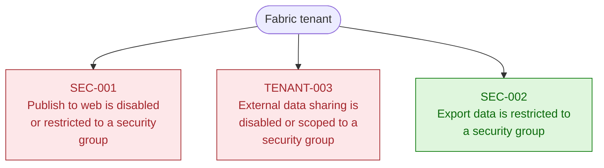
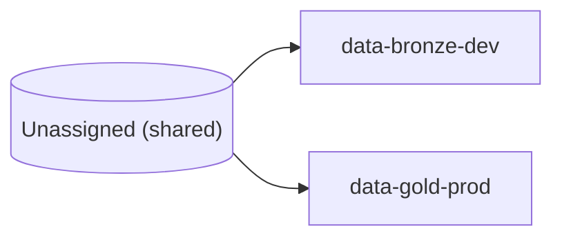

<h1 class="cover-title">Fabric Architecture Review - Sample</h1>

Fabric Architecture Review

<strong>Client:</strong> Contoso 
<strong>Reviewer:</strong> Fabric Review Team 
<strong>Review date:</strong> 2026-01-15 
<strong>Tenant:</strong> <code>***</code>

# Executive Summary

> **Sample report.** All workspace, dataset, and tenant identifiers have been masked (`***`) for public distribution. A real engagement run retains the actual per-resource IDs so every finding is directly actionable.

## Scope

| Metric | Value |
|---|---:|
| Workspaces reviewed | 3 |
| Fabric capacities reviewed | 2 |
| Activity log lookback | 7 days |
| Total checks executed | 40 |
| Failing checks | **29** |
| Passing checks | 6 |
| Informational | 5 |

## Findings overview

| Dimension | Critical | High | Medium | Low | Info |
|---|---:|---:|---:|---:|---:|
| Architecture | 0 | 0 | 1 | 0 | 0 |
| Performance | 0 | 1 | 8 | 0 | 0 |
| Governance | 0 | 0 | 0 | 0 | 0 |
| Security | 0 | 2 | 1 | 0 | 0 |
| Cost | 0 | 0 | 2 | 0 | 0 |
| Tenant Settings | 1 | 1 | 0 | 0 | 0 |
| Notebook Code Review (heuristic) | 0 | 1 | 3 | 2 | 0 |

> Counts above include **failing checks only**. Passing and informational findings are listed in the Detailed Findings section for full traceability.

## Top risks

| Severity | Rule | Title | Impact |
|---|---|---|---|
| CRITICAL | **SEC-001** | Publish to web is disabled or restricted to a security group | Setting is enabled for the entire organization with no security group scoping. |
| HIGH | **BPA-001** | BPA-001: 2 model best-practice violation(s) across 2 model(s) | &mdash; |
| HIGH | **BPA-002** | BPA-002: 1 report issue(s) across 2 report(s) | &mdash; |
| HIGH | **BPA-003** | BPA-003: 1 Direct Lake fallback reason(s) detected | &mdash; |
| HIGH | **NBCODE-001** | Notebook cells contain potential hard-coded secrets (1 cell(s) across 1 notebook(s)) | &mdash; |
| HIGH | **PERF-001** | Throttling risk on 1 capacity(ies) (approaching rejection); worst P95 rejection 85% | &mdash; |
| HIGH | **SEC-006** | Misconfigured datasource instances | 1 item(s) affected |
| HIGH | **SEC-008** | Single-member gateway cluster(s) bound to data sources (SPOF) | &mdash; |
| HIGH | **TENANT-003** | External data sharing is disabled or scoped to a security group | Setting is enabled for the entire organization with no security group scoping. |
| MEDIUM | **ARCH-008** | Personal (My workspace) workspaces in use | &mdash; |

## Methodology

This review is aligned to the [Microsoft Azure Well-Architected Framework](https://learn.microsoft.com/azure/well-architected/) and the [Fabric implementation planning](https://learn.microsoft.com/fabric/admin/) guidance. Checks run against tenant metadata, configuration and metrics surfaced through the Power BI and Fabric Admin REST APIs.

**No customer data is read.** Refer to the Data Safety appendix at the end of this report.

# Environment Overview

An at-a-glance map of the Fabric estate captured by the collectors — the workspaces, items, capacities, access and activity this review is based on. Every number is metadata only; no customer data is read.

Estate

2

Workspaces

+1 personal

2

Capacities

F2, F64

6

Fabric items

across workspaces

3

Semantic models

1 Direct Lake

Items by type

2

Lakehouses

0

Warehouses

1

Reports

0

Notebooks

0

Data pipelines

0

Dataflows

Governance & access

5

Principals with access

users + groups

5/7

Tenant settings on

enabled vs reviewed

1/2

Git-connected

source control

1

Deployment pipelines

release management

1

Gateways

data connectivity

Activity & refresh

12

Activity events

last 7 days

2

Active users

in the window

3

Refreshable models

scheduled refresh

1

Models with refresh failures

in recent history

Review result

29

Failing checks

need attention

6

Passing checks

aligned to checklist

5

Informational

context / not scored

# Architecture Overview

Visual and tabular view of the Fabric estate, built strictly from metadata captured by the collectors. No customer data is read.

### Tenant security posture

Status of the tenant-wide settings evaluated against the checklist.

### Capacity → Workspace topology

Across **1 capacity bucket(s)** and **2 populated workspace(s)**. Excluded from the architecture view: 1 personal / `My workspace` entries.

| Capacity | Workspaces |
|---|---:|
| `Unassigned (shared)` | 2 |

**Capacity `Unassigned (shared)` - 2 workspace(s)**

### Workspace items inventory

Counts of items per workspace returned by the Fabric Scanner API.

| Workspace | Lakehouses | Warehouses | Datasets | Reports | Dataflows | Notebooks | Pipelines |
|---|---:|---:|---:|---:|---:|---:|---:|
| data-bronze-dev | 1 | 0 | 1 | 1 | 0 | 0 | 0 |
| data-gold-prod | 1 | 0 | 2 | 0 | 0 | 0 | 0 |

### Semantic-model storage mode & DirectLake feasibility

**3 semantic model(s)** in scope: **1** already DirectLake, **2** Import (**1** DirectLake candidate(s), **1** blocked by refactor needs). Per-model blockers come from the PERF-012 TMDL audit; **Candidate** means no structural DirectLake blockers were detected in the model definition.

| Workspace | Model | Storage mode | DirectLake | Notes |
|---|---|---|---|---|
| data-bronze-dev | SalesModel | Abf | Blocked | no lakehouse binding, M partitions, calc columns |
| data-gold-prod | DirectLakeModel | DirectLake | Already DirectLake | &mdash; |
| data-gold-prod | FinanceModel | Abf | Candidate | no structural blockers |

### Git source-control coverage

**1 of 2 workspace(s)** are connected to Git source control.

| Workspace | Repository | Branch |
|---|---|---|
| data-gold-prod | `contoso-org/fabric-repo` | `main` |

**Workspaces without Git** (1):
data-bronze-dev

# Semantic Models — VertiPaq Footprint

In-memory storage-engine statistics for each Import / Direct Lake semantic model: total size, column counts and the most expensive tables and columns — the same numbers DAX Studio's VertiPaq Analyzer reports. Metadata only; no customer rows are read.

> _VertiPaq analysis did not run in this collection. Run the pipeline inside a Microsoft Fabric notebook to populate model sizes, cardinality and encoding._

# Detailed Findings

## Architecture

> **1 failing** &middot; 1 informational &middot; 1 passing &middot; 3 total

### MEDIUM &nbsp; FAIL &nbsp; ARCH-008 &mdash; Personal (My workspace) workspaces in use

**Evidence**

- **personalCount:** 1
- **Examples (1):** My workspace

**Recommendation**

Migrate any production content out of personal workspaces into shared, capacity-backed workspaces.

**Reference:** [https://learn.microsoft.com/fabric/get-started/workspaces](https://learn.microsoft.com/fabric/get-started/workspaces)

---
### INFO &nbsp; INFO &nbsp; ARCH-007 &mdash; Empty workspaces (no items)

**Evidence**

- **emptyCount:** 1
- **Examples (1):** My workspace

**Recommendation**

Archive or repurpose empty workspaces to keep the tenant inventory clean.

**Reference:** [https://learn.microsoft.com/fabric/governance/governance-overview](https://learn.microsoft.com/fabric/governance/governance-overview)

---
### HIGH &nbsp; PASS &nbsp; ARCH-013 &mdash; Scanner inventory collected completely

**Evidence**

- **workspacesCollected:** 3
- **workspacesEligible:** 3
- **batchesTotal:** 1
- **scoped:** no

**Recommendation**

No action needed — every eligible workspace was scanned.

**Reference:** [https://learn.microsoft.com/rest/api/power-bi/admin/workspace-info-post-workspace-info](https://learn.microsoft.com/rest/api/power-bi/admin/workspace-info-post-workspace-info)

---

## Performance

> **9 failing** &middot; 1 informational &middot; 1 passing &middot; 11 total

### HIGH &nbsp; FAIL &nbsp; PERF-001 &mdash; Throttling risk on 1 capacity(ies) (approaching rejection); worst P95 rejection 85%

**Evidence**

- **source:** Capacity Metrics App (Usage Summary By Capacities + Items Throttled)
- **dataset:** `{"workspaceId": "***", "name": "Fabric Capacity Metrics"}`
- **thresholds:** `{"criticalPct": 100.0, "warnPct": 70.0, "note": "P95 of the Metrics App future-smoothing window; 100% = active throttling (Throttling (s) > 0)."}`
- **throttledItemsTotal:** 0

**Offenders (1)**

| capacityId | health | itemsThrottled | p95BgRejection7d |
|---|---|---|---|
| *** | Healthy | 0 | 85 |

**Recommendation**

A throttling bucket has reached or is approaching 100% - the point where Fabric actually delays or rejects operations. In the Metrics App, open the named capacity's Throttling page, click the tallest peaks, drill to Timepoint Detail, and sort items by '% of Base capacity' / Total CU (s). Tune the top CU consumers (stagger semantic-model refreshes, reduce query/refresh cost, scope Spark jobs), then enable autoscale or scale-out for the peak windows, or upsize the SKU.

**Reference:** [https://learn.microsoft.com/fabric/enterprise/throttling](https://learn.microsoft.com/fabric/enterprise/throttling)

---
### MEDIUM &nbsp; FAIL &nbsp; PERF-003 &mdash; Semantic models over size threshold (1 over 2048 MB)

**Evidence**

- **warnThresholdMb:** 2048
- **criticalThresholdMb:** 8192
- **modelsWithSizeMetadata:** 3

**Oversizedmodels (1)**

| name | workspace | storageMode |
|---|---|---|
| SalesModel | data-bronze-dev | Abf |

**Recommendation**

For large Import models, reduce cardinality and unused columns, add aggregations or incremental refresh, and evaluate Direct Lake where source tables live in OneLake Delta.

**Reference:** [https://learn.microsoft.com/fabric/get-started/direct-lake-overview](https://learn.microsoft.com/fabric/get-started/direct-lake-overview)

---
### MEDIUM &nbsp; FAIL &nbsp; PERF-004 &mdash; Datasets with high refresh-failure ratio

**Evidence**

- **threshold:** 0.2
- **count:** 1

**Datasets (1)**

| name | workspace | failureRatio | lastStatus |
|---|---|---|---|
| SalesModel | data-bronze-dev | 0.5 | Failed |

**Recommendation**

Investigate failing datasets — common causes are expired gateway credentials, source schema drift, or out-of-memory in Import models.

**Reference:** [https://learn.microsoft.com/power-bi/connect-data/refresh-troubleshooting-refresh-scenarios](https://learn.microsoft.com/power-bi/connect-data/refresh-troubleshooting-refresh-scenarios)

---
### MEDIUM &nbsp; FAIL &nbsp; PERF-005 &mdash; Datasets with no successful refresh in 30 days

**Evidence**

- **thresholdDays:** 30
- **count:** 3

**Datasets (3)**

| name | workspace | lastSuccessfulRefresh |
|---|---|---|
| SalesModel | data-bronze-dev | 2026-01-10T12:40:00Z |
| FinanceModel | data-gold-prod | 2026-01-13T12:10:00Z |
| DirectLakeModel | data-gold-prod | 2026-01-14T12:05:00Z |

**Recommendation**

Confirm whether these models are still in use; archive or fix the refresh schedule.

**Reference:** [https://learn.microsoft.com/fabric/data-engineering/lakehouse-table-maintenance](https://learn.microsoft.com/fabric/data-engineering/lakehouse-table-maintenance)

---
### MEDIUM &nbsp; FAIL &nbsp; PERF-006 &mdash; Refreshable datasets without a scheduled refresh history

**Evidence**

- **count:** 1

**Datasets (1)**

| name | workspace |
|---|---|
| FinanceModel | data-gold-prod |

**Recommendation**

Configure scheduled refresh (or document the manual-only contract) so data stays current.

**Reference:** [https://learn.microsoft.com/power-bi/connect-data/refresh-data](https://learn.microsoft.com/power-bi/connect-data/refresh-data)

---
### MEDIUM &nbsp; FAIL &nbsp; PERF-011 &mdash; Capacities running hot (>=70% avg CU 7d) without autoscale

**Evidence**

**Capacities (2)**

| name | sku | avgCU7d | autoscaleEnabled |
|---|---|---|---|
| Capacity Dev | F2 | null | no |
| Capacity Prod | F64 | 78 | no |

**Hotwithoutautoscale (1)**

| name | sku | avgCU7d | autoscaleEnabled |
|---|---|---|---|
| Capacity Prod | F64 | 78 | no |

**Recommendation**

Enable autoscale (or schedule a manual scale-out window) on capacities that regularly exceed 70% average CU - otherwise the next workload increase will throttle.

**Reference:** [https://learn.microsoft.com/fabric/enterprise/scale-capacity](https://learn.microsoft.com/fabric/enterprise/scale-capacity)

---
### MEDIUM &nbsp; FAIL &nbsp; PERF-012 &mdash; PERF-012: SalesModel — Import-mode model blocks DirectLake migration (no_lakehouse_binding, m_partitions, calculated_columns)

**Evidence**

- **workspace:** data-bronze-dev
- **workspaceId:** ***
- **datasetId:** ***
- **storageMode:** Abf
- **Direct Lake audit summary:** storage partitions are `import`; Power Query/M partitions: yes; source connectors: Web.Contents; calculated columns: 1; calculated tables: 0

**Direct Lake blockers (3)**

| Blocker | Why it matters | Evidence |
|---|---|---|
| no lakehouse binding | No entityName / DirectLake table binding found; data is materialised via M. |  |
| m partitions | Power Query (M) partitions present; DirectLake disallows M shaping. | Web.Contents |
| calculated columns | 1 calculated column(s) detected; DirectLake-on-Lakehouse disallows them. | 1 object(s) |

**Calculated columns (1)**

These columns are defined by DAX expressions in the semantic model. Direct Lake does not support them as model-side calculated columns; move the logic upstream into Delta tables or replace it with measures where appropriate.

| Table | Calculated column |
|---|---|
| SalesFact | Margin |

**Model table sources (1)**

This table shows where each model table appears to come from. `Power Query/M` means the model uses an import query; `calculated table` means the table is produced by a DAX calculated partition. Source hints are metadata-only and may point to SQL objects, files, inline tables, or another model query/expression.

| Model table | Partition/source type | Source hint |
|---|---|---|
| SalesFact | Power Query/M |  |
- **Metadata coverage note:** the analyzer found 0 source-column mapping(s) in the model definition. They are retained in `findings_storage_mode.json` for traceability, but the PDF focuses on Direct Lake blockers, calculated objects, and table sources.

**Recommendation**

DirectLake is not reachable for this model without a refactor: replace M-based partitions with a direct lakehouse-table binding (entityName), push calculated columns/tables into the upstream Delta tables (silver/gold), and re-cast any unsupported data types. Until then, keep the model in Import and ensure a scheduled refresh is configured (PERF-006).

**Reference:** [https://learn.microsoft.com/fabric/get-started/direct-lake-overview](https://learn.microsoft.com/fabric/get-started/direct-lake-overview)

---
### MEDIUM &nbsp; FAIL &nbsp; PERF-012 &mdash; PERF-012: DirectLake feasibility — 2 Import-mode model(s) audited, 1 blocked, 1 candidate(s)

**Evidence**

- **auditedModels:** 2
- **blockedModels:** 1
- **candidateModels:** 1
- **directLakeModels:** 1
- **totalDatasets:** 3

**Recommendation**

Use the per-model PERF-012 findings to plan the storage-mode roadmap. Models flagged 'candidate' can be migrated to DirectLake with little rework; 'blocked' models need the listed blockers cleared first.

**Reference:** [https://learn.microsoft.com/fabric/get-started/direct-lake-overview](https://learn.microsoft.com/fabric/get-started/direct-lake-overview)

---
### MEDIUM &nbsp; FAIL &nbsp; PERF-013 &mdash; PERF-013: 0 Direct Lake model(s) pinned to DirectQuery, 1 relying on implicit (automatic) fallback

**Evidence**

- **directLakeModels:** 1
- **explicitNoFallback:** 0

**Implicitautomaticfallback (1)**

| name | workspace |
|---|---|
| DirectLakeModel | data-gold-prod |

**Recommendation**

Set directLakeBehavior deliberately. Use DirectLakeOnly to fail fast (so guardrail breaches are visible) or Automatic only when a monitored DirectQuery fallback is acceptable. Investigate any model pinned to DirectQueryOnly - it is not getting Direct Lake performance.

**Reference:** [https://learn.microsoft.com/fabric/get-started/direct-lake-overview#fallback-behavior](https://learn.microsoft.com/fabric/get-started/direct-lake-overview#fallback-behavior)

---
### HIGH &nbsp; INFO &nbsp; PERF-002 &mdash; 7-day average CU% elevated on '***' (78.0%)

**Evidence**

- **source:** Capacity Metrics App (Usage Summary By Capacities, 7d/24h/1h)
- **dataset:** `{"workspaceId": "***", "name": "Fabric Capacity Metrics"}`

**Capacities (1)**

| capacityId | health | avgCU7d |
|---|---|---|
| *** | Healthy | 78 |

**Recommendation**

Average CU% between 70% and 80% is close to throttling threshold. Tune the heaviest workloads now or plan autoscale before the next workload increase.

**Reference:** [https://learn.microsoft.com/fabric/enterprise/optimize-capacity](https://learn.microsoft.com/fabric/enterprise/optimize-capacity)

---
### MEDIUM &nbsp; PASS &nbsp; PERF-007 &mdash; Datasets with average refresh > 2.0h

**Evidence**

- **thresholdHours:** 2
- **count:** 0

**Recommendation**

Enable incremental refresh or move to Direct Lake; long refreshes contend for capacity CU.

**Reference:** [https://learn.microsoft.com/power-bi/connect-data/incremental-refresh-overview](https://learn.microsoft.com/power-bi/connect-data/incremental-refresh-overview)

---

## Governance

> **0 failing** &middot; 0 informational &middot; 1 passing &middot; 1 total

### HIGH &nbsp; PASS &nbsp; GOV-001 &mdash; Workspaces with fewer than 2 admins

**Evidence**

- **evaluatedWorkspaces:** 2
- **minAdmins:** 2
- **underAdminCount:** 0

**Recommendation**

Assign at least two workspace admins (preferably via a security group) to avoid orphan risk.

**Reference:** [https://learn.microsoft.com/fabric/get-started/roles-workspaces](https://learn.microsoft.com/fabric/get-started/roles-workspaces)

---

## Security

> **3 failing** &middot; 1 informational &middot; 1 passing &middot; 5 total

### HIGH &nbsp; FAIL &nbsp; SEC-006 &mdash; Misconfigured datasource instances

**Evidence**

- **count:** 1

**Examples (1)**

| type | id |
|---|---|
| Sql | *** |

**Recommendation**

Repair gateway bindings, refresh expired OAuth credentials, or remove orphaned datasources.

**Reference:** [https://learn.microsoft.com/power-bi/connect-data/service-gateway-onprem](https://learn.microsoft.com/power-bi/connect-data/service-gateway-onprem)

---
### HIGH &nbsp; FAIL &nbsp; SEC-008 &mdash; Single-member gateway cluster(s) bound to data sources (SPOF)

**Evidence**

- **clusterCount:** 1

**Singlememberclusters (1)**

| name | gatewayType | memberCount | datasourceCount |
|---|---|---|---|
| on-prem-cluster | OnPremises | 1 | 2 |

**Recommendation**

Add at least one secondary gateway member to every cluster carrying production data sources to remove the single point of failure.

**Reference:** [https://learn.microsoft.com/data-integration/gateway/service-gateway-high-availability-clusters](https://learn.microsoft.com/data-integration/gateway/service-gateway-high-availability-clusters)

---
### MEDIUM &nbsp; FAIL &nbsp; SEC-004 &mdash; Workspaces with individual users (not groups) as admins

**Evidence**

- **offenderCount:** 2

**Examples (2)**

| workspace |
|---|
| data-bronze-dev |
| My workspace |

**Recommendation**

Replace individual admin assignments with Entra security groups for lifecycle management.

**Reference:** [https://learn.microsoft.com/fabric/get-started/roles-workspaces](https://learn.microsoft.com/fabric/get-started/roles-workspaces)

---
### HIGH &nbsp; INFO &nbsp; SEC-003 &mdash; Guest user access setting not returned

**Evidence**

- **reason:** Tenant settings did not include AllowGuestUserToAccessSharedContent.

**Recommendation**

Verify the signed-in user is a Fabric Administrator and re-run the tenant collector.

**Reference:** [https://learn.microsoft.com/fabric/admin/service-admin-portal-export-sharing](https://learn.microsoft.com/fabric/admin/service-admin-portal-export-sharing)

---
### MEDIUM &nbsp; PASS &nbsp; SEC-005 &mdash; Workspaces with >10 individual principals

**Evidence**

- **threshold:** 10
- **count:** 0

**Recommendation**

Consolidate broad access into Entra security groups; remove unused direct assignments.

**Reference:** [https://learn.microsoft.com/fabric/get-started/roles-workspaces](https://learn.microsoft.com/fabric/get-started/roles-workspaces)

---

## Cost

> **2 failing** &middot; 1 informational &middot; 1 passing &middot; 4 total

### MEDIUM &nbsp; FAIL &nbsp; COST-002 &mdash; Reviewer attested Pause/Resume but no Azure automation matched the capacity

**Evidence**

- **reason:** CAPACITY_AUTO_PAUSE_CONFIGURED is set, and the Azure ARM scan ran successfully, but no runbook or Logic App content referenced this tenant's Fabric capacities together with suspend/resume verbs. Either the automation lives in a subscription this user cannot read, the runbook content endpoint returned 403, or the attestation is stale.
- **subscriptionsScanned:** 1
- **currentlyPaused:** 0

**Capacitiesatscan (2)**

| name | sku |
|---|---|
| Capacity Dev | F2 |
| Capacity Prod | F64 |

**Recommendation**

Either grant the signed-in user Reader on the subscription that hosts the automation account / Logic App and re-run, or unset CAPACITY_AUTO_PAUSE_CONFIGURED if the schedule no longer exists.

**Reference:** [https://learn.microsoft.com/fabric/enterprise/pause-resume](https://learn.microsoft.com/fabric/enterprise/pause-resume)

---
### MEDIUM &nbsp; FAIL &nbsp; COST-005 &mdash; Large capacities (F64+) hosting fewer than 5 workspaces

**Evidence**

- **count:** 1

**Capacities (1)**

| name | sku | workspaces |
|---|---|---|
| Capacity Prod | F64 | 2 |

**Recommendation**

Right-size: either consolidate workspaces onto this capacity or downgrade the SKU.

**Reference:** [https://learn.microsoft.com/fabric/enterprise/optimize-capacity](https://learn.microsoft.com/fabric/enterprise/optimize-capacity)

---
### MEDIUM &nbsp; INFO &nbsp; COST-003 &mdash; Non-production capacities (candidates for Pause/Resume)

**Evidence**

- **count:** 1

**Capacities (1)**

| name | sku |
|---|---|
| Capacity Dev | F2 |

**Recommendation**

Configure an Azure Automation runbook or schedule to pause non-production capacities outside business hours.

**Reference:** [https://learn.microsoft.com/fabric/enterprise/pause-resume](https://learn.microsoft.com/fabric/enterprise/pause-resume)

---
### HIGH &nbsp; PASS &nbsp; COST-001 &mdash; Active capacities with no assigned workspaces

**Evidence**

- **count:** 0

**Recommendation**

Pause or delete empty capacities; they incur SKU charges with zero utilization.

**Reference:** [https://learn.microsoft.com/fabric/enterprise/optimize-capacity](https://learn.microsoft.com/fabric/enterprise/optimize-capacity)

---

## Tenant Settings

> **2 failing** &middot; 0 informational &middot; 1 passing &middot; 3 total

### CRITICAL &nbsp; FAIL &nbsp; SEC-001 &mdash; Publish to web is disabled or restricted to a security group

**Evidence**

- **setting name:** PublishToWeb
- **enabled:** yes
- **canSpecifySecurityGroups:** yes
- **reason:** Setting is enabled for the entire organization with no security group scoping.

**Recommendation**

Tenant setting "Publish to web" is disabled or restricted to a specific security group.

**Reference:** [https://learn.microsoft.com/power-bi/admin/service-admin-portal-export-sharing#publish-to-web](https://learn.microsoft.com/power-bi/admin/service-admin-portal-export-sharing#publish-to-web)

---
### HIGH &nbsp; FAIL &nbsp; TENANT-003 &mdash; External data sharing is disabled or scoped to a security group

**Evidence**

- **setting name:** AllowExternalDataSharing
- **enabled:** yes
- **canSpecifySecurityGroups:** yes
- **reason:** Setting is enabled for the entire organization with no security group scoping.

**Recommendation**

External sharing tenant settings ("Allow sharing to external users", "Invite external users to your organization") are disabled or scoped to a security group. Tenant-wide external sharing is a major data-exfiltration vector.

**Reference:** [https://learn.microsoft.com/fabric/admin/service-admin-portal-export-sharing](https://learn.microsoft.com/fabric/admin/service-admin-portal-export-sharing)

---
### HIGH &nbsp; PASS &nbsp; SEC-002 &mdash; Export data is restricted to a security group

**Evidence**

- **setting name:** ExportData
- **enabled:** no
- **canSpecifySecurityGroups:** yes
- **reason:** Setting is disabled (effectively scoped to no one).

**Recommendation**

Tenant setting "Export data" is restricted to a security group, not enabled tenant-wide.

**Reference:** [https://learn.microsoft.com/power-bi/admin/service-admin-portal-export-sharing](https://learn.microsoft.com/power-bi/admin/service-admin-portal-export-sharing)

---

## Notebook Code Review (heuristic)

> **6 failing** &middot; 0 informational &middot; 0 passing &middot; 6 total

### HIGH &nbsp; FAIL &nbsp; NBCODE-001 &mdash; Notebook cells contain potential hard-coded secrets (1 cell(s) across 1 notebook(s))

**Evidence**

- **notebooksScanned:** 2
- **codeCellsScanned:** 2
- **matchedCellCount:** 1
- **matchedNotebookCount:** 1
- **heuristic:** yes
- **note:** Pattern-based scan — review each match before acting; false positives are possible.

**Examples (1)**

| workspace | notebook | cellIndexes |
|---|---|---|
| data-bronze-dev | ProcessSales | [0] |

**Recommendation**

Replace literal keys / SAS / tokens / passwords with Key Vault lookups via notebookutils.credentials.getSecret(...) or a workspace-managed-identity flow.

**Reference:** [https://learn.microsoft.com/fabric/data-engineering/microsoft-spark-utilities](https://learn.microsoft.com/fabric/data-engineering/microsoft-spark-utilities)

---
### MEDIUM &nbsp; FAIL &nbsp; NBCODE-002 &mdash; Notebook cells install packages inline (%pip / !pip / %conda) (1 cell(s) across 1 notebook(s))

**Evidence**

- **notebooksScanned:** 2
- **codeCellsScanned:** 2
- **matchedCellCount:** 1
- **matchedNotebookCount:** 1
- **heuristic:** yes
- **note:** Pattern-based scan — review each match before acting; false positives are possible.

**Examples (1)**

| workspace | notebook | cellIndexes |
|---|---|---|
| data-bronze-dev | ProcessSales | [0] |

**Recommendation**

Move dependencies to a Fabric environment so installs are baked in once, not repeated on every run, and so library versions are pinned across promotions.

**Reference:** [https://learn.microsoft.com/fabric/data-engineering/environment-manage-library](https://learn.microsoft.com/fabric/data-engineering/environment-manage-library)

---
### MEDIUM &nbsp; FAIL &nbsp; NBCODE-003 &mdash; Notebook cells call unbounded .collect() / .toPandas() on Spark DataFrames (1 cell(s) across 1 notebook(s))

**Evidence**

- **notebooksScanned:** 2
- **codeCellsScanned:** 2
- **matchedCellCount:** 1
- **matchedNotebookCount:** 1
- **heuristic:** yes
- **note:** Pattern-based scan — review each match before acting; false positives are possible.

**Examples (1)**

| workspace | notebook | cellIndexes |
|---|---|---|
| data-bronze-dev | ProcessSales | [0] |

**Recommendation**

Bare .collect()/.toPandas() pulls every row to the driver and is a common OOM cause. Bound the result first (.limit(N), .first(), .head(N), .take(N), or aggregate to a single row), or persist with .write.format("delta") instead of materialising on the driver. Note: Fabric's display() is safe — it auto-truncates and is not flagged by this rule.

**Reference:** [https://learn.microsoft.com/fabric/data-engineering/spark-job-best-practices](https://learn.microsoft.com/fabric/data-engineering/spark-job-best-practices)

---
### MEDIUM &nbsp; FAIL &nbsp; NBCODE-004 &mdash; Notebook cells use Databricks-only APIs (1 cell(s) across 1 notebook(s))

**Evidence**

- **notebooksScanned:** 2
- **codeCellsScanned:** 2
- **matchedCellCount:** 1
- **matchedNotebookCount:** 1
- **heuristic:** yes
- **note:** Pattern-based scan — review each match before acting; false positives are possible.

**Examples (1)**

| workspace | notebook | cellIndexes |
|---|---|---|
| data-bronze-dev | ProcessSales | [0] |

**Recommendation**

Replace dbutils.* with notebookutils.*, /dbfs paths with abfss:// or attached lakehouse references, and Databricks MLflow URIs with the Fabric MLflow integration.

**Reference:** [https://learn.microsoft.com/fabric/data-engineering/microsoft-spark-utilities](https://learn.microsoft.com/fabric/data-engineering/microsoft-spark-utilities)

---
### LOW &nbsp; FAIL &nbsp; NBCODE-005 &mdash; Notebook cells embed hard-coded abfss:// paths or workspace / lakehouse GUIDs (1 cell(s) across 1 notebook(s))

**Evidence**

- **notebooksScanned:** 2
- **codeCellsScanned:** 2
- **matchedCellCount:** 1
- **matchedNotebookCount:** 1
- **heuristic:** yes
- **note:** Pattern-based scan — review each match before acting; false positives are possible.

**Examples (1)**

| workspace | notebook | cellIndexes |
|---|---|---|
| data-bronze-dev | ProcessSales | [0] |

**Recommendation**

Parameterise the lakehouse / path, or rely on the notebook's attached default lakehouse. Hard-coded GUIDs break dev->test->prod promotion via deployment pipelines and Git integration.

**Reference:** [https://learn.microsoft.com/fabric/onelake/onelake-overview](https://learn.microsoft.com/fabric/onelake/onelake-overview)

---
### LOW &nbsp; FAIL &nbsp; NBCODE-006 &mdash; Notebook cells write data in non-Delta formats (parquet / csv / json / orc / avro) (1 cell(s) across 1 notebook(s))

**Evidence**

- **notebooksScanned:** 2
- **codeCellsScanned:** 2
- **matchedCellCount:** 1
- **matchedNotebookCount:** 1
- **heuristic:** yes
- **note:** Pattern-based scan — review each match before acting; false positives are possible.

**Examples (1)**

| workspace | notebook | cellIndexes |
|---|---|---|
| data-bronze-dev | ProcessSales | [0] |

**Recommendation**

Prefer .format("delta"). Delta gives ACID, time travel, V-Order and is required for Direct Lake. Non-Delta tables silently lose those capabilities in OneLake.

**Reference:** [https://learn.microsoft.com/fabric/data-engineering/lakehouse-and-delta-tables](https://learn.microsoft.com/fabric/data-engineering/lakehouse-and-delta-tables)

---

## Best Practices

> **6 failing** &middot; 1 informational &middot; 0 passing &middot; 7 total

### HIGH &nbsp; FAIL &nbsp; BPA-001 &mdash; BPA-001: 2 model best-practice violation(s) across 2 model(s)

**Evidence**

- **violations:** 2
- **Models (1):** Sales DL

**Recommendation**

Clear high-impact BPA rule violations (storage, formatting, perf) in the flagged models.

**Reference:** [https://learn.microsoft.com/fabric/data-warehouse/semantic-link-labs](https://learn.microsoft.com/fabric/data-warehouse/semantic-link-labs)

---
### HIGH &nbsp; FAIL &nbsp; BPA-002 &mdash; BPA-002: 1 report issue(s) across 2 report(s)

**Evidence**

- **issues:** 1
- **Reports (1):** Exec Dash

**Recommendation**

Fix reports binding to missing fields or with orphaned visuals before publishing.

**Reference:** [https://learn.microsoft.com/power-bi/create-reports/](https://learn.microsoft.com/power-bi/create-reports/)

---
### HIGH &nbsp; FAIL &nbsp; BPA-003 &mdash; BPA-003: 1 Direct Lake fallback reason(s) detected

**Evidence**

- **fallbackReasons:** 1
- **Models (1):** Sales DL

**Recommendation**

Resolve fallback causes (guardrails, unsupported types) so models stay on Direct Lake.

**Reference:** [https://learn.microsoft.com/fabric/get-started/direct-lake-overview](https://learn.microsoft.com/fabric/get-started/direct-lake-overview)

---
### MEDIUM &nbsp; FAIL &nbsp; BPA-005 &mdash; BPA-005: 1 Delta table health concern(s)

**Evidence**

- **concerns:** 1
- **Models (1):** Sales DL

**Recommendation**

Run OPTIMIZE/V-Order and consolidate small files for the flagged Delta tables.

**Reference:** [https://learn.microsoft.com/fabric/data-engineering/delta-optimization-and-v-order](https://learn.microsoft.com/fabric/data-engineering/delta-optimization-and-v-order)

---
### MEDIUM &nbsp; FAIL &nbsp; BPA-006 &mdash; BPA-006: 1 unused model object(s)

**Evidence**

- **unused:** 1
- **Models (1):** Sales DL

**Recommendation**

Remove unused columns/tables/measures to shrink models and refresh time.

**Reference:** [https://learn.microsoft.com/fabric/data-warehouse/semantic-link-labs](https://learn.microsoft.com/fabric/data-warehouse/semantic-link-labs)

---
### MEDIUM &nbsp; FAIL &nbsp; BPA-007 &mdash; BPA-007: 1 capacity(ies) on legacy P-SKU need F-SKU migration

**Evidence**

- **total:** 2
- **Pskus (1):** P1-legacy

**Recommendation**

Plan migration from P-SKU Premium capacities to Fabric F-SKUs before EOL.

**Reference:** [https://learn.microsoft.com/fabric/enterprise/capacity-settings](https://learn.microsoft.com/fabric/enterprise/capacity-settings)

---
### MEDIUM &nbsp; INFO &nbsp; BPA-004 &mdash; BPA-004: report BPA evaluated for 2 report(s)

**Evidence**

- **reports:** 2
- **issues:** 1

**Recommendation**

Address medium report BPA items (visual count, slow visuals, layout) over time.

**Reference:** [https://learn.microsoft.com/fabric/data-warehouse/semantic-link-labs](https://learn.microsoft.com/fabric/data-warehouse/semantic-link-labs)

---

# Recommendations &amp; Roadmap

Findings are prioritized by severity and the effort typically required to remediate them. Implement Critical and High items immediately, Medium items in the next review cycle, and Low / Info items opportunistically as part of ongoing operations.

## Immediate &mdash; Critical / High

| Rule | Title | Recommendation |
|---|---|---|
| **SEC-001** | Publish to web is disabled or restricted to a security group | Tenant setting "Publish to web" is disabled or restricted to a specific security group. |
| **BPA-001** | BPA-001: 2 model best-practice violation(s) across 2 model(s) | Clear high-impact BPA rule violations (storage, formatting, perf) in the flagged models. |
| **BPA-002** | BPA-002: 1 report issue(s) across 2 report(s) | Fix reports binding to missing fields or with orphaned visuals before publishing. |
| **BPA-003** | BPA-003: 1 Direct Lake fallback reason(s) detected | Resolve fallback causes (guardrails, unsupported types) so models stay on Direct Lake. |
| **NBCODE-001** | Notebook cells contain potential hard-coded secrets (1 cell(s) across 1 notebook(s)) | Replace literal keys / SAS / tokens / passwords with Key Vault lookups via notebookutils.credentials.getSecret(...) or a workspace-managed-identity flow. |
| **PERF-001** | Throttling risk on 1 capacity(ies) (approaching rejection); worst P95 rejection 85% | A throttling bucket has reached or is approaching 100% - the point where Fabric actually delays or rejects operations. In the Metrics App, open the named capacity's Throttling page, click the tallest peaks, drill to Timepoint Detail, and sort items by '% of Base capacity' / Total CU (s). Tune the top CU consumers (stagger semantic-model refreshes, reduce query/refresh cost, scope Spark jobs), then enable autoscale or scale-out for the peak windows, or upsize the SKU. |
| **SEC-006** | Misconfigured datasource instances | Repair gateway bindings, refresh expired OAuth credentials, or remove orphaned datasources. |
| **SEC-008** | Single-member gateway cluster(s) bound to data sources (SPOF) | Add at least one secondary gateway member to every cluster carrying production data sources to remove the single point of failure. |
| **TENANT-003** | External data sharing is disabled or scoped to a security group | External sharing tenant settings ("Allow sharing to external users", "Invite external users to your organization") are disabled or scoped to a security group. Tenant-wide external sharing is a major data-exfiltration vector. |

## Next review cycle &mdash; Medium

| Rule | Title | Recommendation |
|---|---|---|
| **ARCH-008** | Personal (My workspace) workspaces in use | Migrate any production content out of personal workspaces into shared, capacity-backed workspaces. |
| **BPA-005** | BPA-005: 1 Delta table health concern(s) | Run OPTIMIZE/V-Order and consolidate small files for the flagged Delta tables. |
| **BPA-006** | BPA-006: 1 unused model object(s) | Remove unused columns/tables/measures to shrink models and refresh time. |
| **BPA-007** | BPA-007: 1 capacity(ies) on legacy P-SKU need F-SKU migration | Plan migration from P-SKU Premium capacities to Fabric F-SKUs before EOL. |
| **COST-002** | Reviewer attested Pause/Resume but no Azure automation matched the capacity | Either grant the signed-in user Reader on the subscription that hosts the automation account / Logic App and re-run, or unset CAPACITY_AUTO_PAUSE_CONFIGURED if the schedule no longer exists. |
| **COST-005** | Large capacities (F64+) hosting fewer than 5 workspaces | Right-size: either consolidate workspaces onto this capacity or downgrade the SKU. |
| **NBCODE-002** | Notebook cells install packages inline (%pip / !pip / %conda) (1 cell(s) across 1 notebook(s)) | Move dependencies to a Fabric environment so installs are baked in once, not repeated on every run, and so library versions are pinned across promotions. |
| **NBCODE-003** | Notebook cells call unbounded .collect() / .toPandas() on Spark DataFrames (1 cell(s) across 1 notebook(s)) | Bare .collect()/.toPandas() pulls every row to the driver and is a common OOM cause. Bound the result first (.limit(N), .first(), .head(N), .take(N), or aggregate to a single row), or persist with .write.format("delta") instead of materialising on the driver. Note: Fabric's display() is safe — it auto-truncates and is not flagged by this rule. |
| **NBCODE-004** | Notebook cells use Databricks-only APIs (1 cell(s) across 1 notebook(s)) | Replace dbutils.* with notebookutils.*, /dbfs paths with abfss:// or attached lakehouse references, and Databricks MLflow URIs with the Fabric MLflow integration. |
| **PERF-003** | Semantic models over size threshold (1 over 2048 MB) | For large Import models, reduce cardinality and unused columns, add aggregations or incremental refresh, and evaluate Direct Lake where source tables live in OneLake Delta. |
| **PERF-004** | Datasets with high refresh-failure ratio | Investigate failing datasets — common causes are expired gateway credentials, source schema drift, or out-of-memory in Import models. |
| **PERF-005** | Datasets with no successful refresh in 30 days | Confirm whether these models are still in use; archive or fix the refresh schedule. |
| **PERF-006** | Refreshable datasets without a scheduled refresh history | Configure scheduled refresh (or document the manual-only contract) so data stays current. |
| **PERF-011** | Capacities running hot (>=70% avg CU 7d) without autoscale | Enable autoscale (or schedule a manual scale-out window) on capacities that regularly exceed 70% average CU - otherwise the next workload increase will throttle. |
| **SEC-004** | Workspaces with individual users (not groups) as admins | Replace individual admin assignments with Entra security groups for lifecycle management. |
| **PERF-012** | PERF-012: SalesModel — Import-mode model blocks DirectLake migration (no_lakehouse_binding, m_partitions, calculated_columns) | DirectLake is not reachable for this model without a refactor: replace M-based partitions with a direct lakehouse-table binding (entityName), push calculated columns/tables into the upstream Delta tables (silver/gold), and re-cast any unsupported data types. Until then, keep the model in Import and ensure a scheduled refresh is configured (PERF-006). |
| **PERF-012** | PERF-012: DirectLake feasibility — 2 Import-mode model(s) audited, 1 blocked, 1 candidate(s) | Use the per-model PERF-012 findings to plan the storage-mode roadmap. Models flagged 'candidate' can be migrated to DirectLake with little rework; 'blocked' models need the listed blockers cleared first. |
| **PERF-013** | PERF-013: 0 Direct Lake model(s) pinned to DirectQuery, 1 relying on implicit (automatic) fallback | Set directLakeBehavior deliberately. Use DirectLakeOnly to fail fast (so guardrail breaches are visible) or Automatic only when a monitored DirectQuery fallback is acceptable. Investigate any model pinned to DirectQueryOnly - it is not getting Direct Lake performance. |

## Backlog &mdash; Low / Info

| Rule | Title |
|---|---|
| **NBCODE-005** | Notebook cells embed hard-coded abfss:// paths or workspace / lakehouse GUIDs (1 cell(s) across 1 notebook(s)) |
| **NBCODE-006** | Notebook cells write data in non-Delta formats (parquet / csv / json / orc / avro) (1 cell(s) across 1 notebook(s)) |

---

## Data Safety appendix

This assessment runs strictly against metadata, configuration and metrics surfaced by the Microsoft Fabric / Power BI Admin REST APIs and the Fabric Scanner API. **No customer dataset rows, report visuals, lakehouse tables, notebook contents or pipeline payloads were read.** All collector outputs are stored locally in `output/raw/` and can be deleted after the engagement.